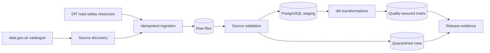

# Data Pipeline Quality Lab

A production-minded data-pipeline testing showcase built around UK Department for Transport Road Safety Data published through [data.gov.uk](https://www.data.gov.uk/).

The project will demonstrate how to establish confidence in a batch data product: source discovery, ingestion, validation, transformation, reconciliation, failure handling, observability, and release evidence. It will deliberately include realistic bad-data scenarios rather than presenting only a successful pipeline run.

## Intended architecture

## Proposed technology

- Python 3.13
- PostgreSQL
- Polars and PyArrow
- dbt-postgres
- Prefect
- pytest and Hypothesis
- Pandera for dataframe contracts
- Testcontainers
- OpenTelemetry
- GitHub Actions

DuckDB is intentionally not used.

## Quality themes

- Schema and semantic drift
- Duplicate and replayed records
- Referential integrity between collisions, vehicles, and casualties
- Missing or partially published source files
- Idempotent reruns and safe backfills
- Reconciliation between pipeline layers
- Freshness, completeness, and anomaly detection
- Quarantine with explicit reason codes
- Reproducible CI evidence

See [IMPLEMENTATION_PLAN.md](IMPLEMENTATION_PLAN.md) for the planned delivery sequence.
