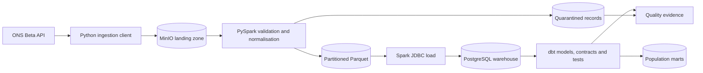

# Data Pipeline Quality Lab

A production-minded data-pipeline testing showcase built around the [Office for National Statistics API](https://developer.ons.gov.uk/).

The pipeline will request a Census 2021 dataset covering population by age, sex, and geography, preserve the generated source artifacts, process them with PySpark, and use dbt to build and test an analytical warehouse. The emphasis is not simply moving data: it is producing defensible evidence that revisions, dimensional joins, aggregations, and reruns are correct.

## Intended architecture

## Technology

- Python 3.13 for ONS API integration and pipeline control
- PySpark for distributed parsing, validation, deduplication, and Parquet production
- MinIO as the local S3-compatible landing and curated-data store
- PostgreSQL as the analytical warehouse
- dbt Core with `dbt-postgres` for transformation, contracts, tests, snapshots, documentation, and lineage
- pytest and Hypothesis for application and property-based testing
- Testcontainers for PostgreSQL and integration boundaries
- Docker Compose for the reproducible local platform
- OpenTelemetry-compatible structured telemetry
- GitHub Actions for deterministic checks and published evidence

DuckDB is intentionally not used.

## Use case

The first release will process one bounded Census 2021 extract across:

- geography
- age
- sex
- observation values

The resulting mart will support population totals and distributions by geography, age band, and sex. ONS dataset edition and version metadata will be retained so revised publications can be compared instead of silently replacing history.

## Quality themes

- ONS dataset, edition, and version changes
- Asynchronous filter creation and download readiness
- API rate limits and `Retry-After` handling
- CSV/CSVW schema agreement
- PySpark schema drift and partition correctness
- Duplicate and replayed observations
- Geographic and demographic dimension integrity
- dbt model contracts and source freshness
- Reconciliation from ONS observations to published marts
- Revision-aware snapshots and safe backfills
- Reproducible test and release evidence

See [IMPLEMENTATION_PLAN.md](IMPLEMENTATION_PLAN.md) for the delivery sequence.
