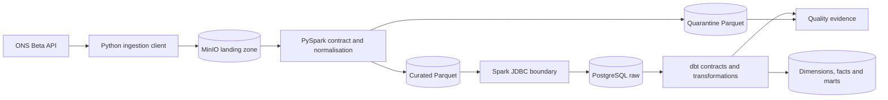

# Data Pipeline Quality Lab

[](https://github.com/richirobertson/data-pipeline-quality-lab/actions/workflows/quality.yml)

A production-minded data-pipeline testing reference implementation built around the [Office for National Statistics API](https://developer.ons.gov.uk/).

The repository uses the published Census 2021 `TS009` Age by Sex dataset. It preserves ONS source provenance, validates and normalises observations with PySpark, and uses dbt to build a contracted dimensional warehouse. Deliberate failure fixtures show how the pipeline explains invalid, conflicting, duplicate, and unreconciled data.

## What works

- Typed ONS API client for dataset versions and asynchronous filter outputs
- Bounded retry behaviour with explicit `429` and `Retry-After` handling
- Canonical filter hashes and content-addressed ingestion manifests
- Immutable filesystem and S3/MinIO object-store adapters
- CSVW and exact published CSV-header contracts
- PySpark validation, quarantine, deterministic deduplication, provenance, and Parquet output
- PostgreSQL warehouse scaffold with dbt sources, contracts, dimensions, facts, marts, and audit models
- Reconciliation tests from raw seed to staging and fact layers
- Docker Compose platform containing PostgreSQL and MinIO
- Deterministic CI covering Python, Spark, dbt, and Docker
- Generated Markdown quality evidence

A committed [sample quality report](evidence/sample-quality-report.md) shows the
reviewer-facing output from the deterministic vertical slice.

## Architecture



The boundaries are deliberate:

- Python owns HTTP workflow and provenance.
- PySpark owns technical parsing, validation, deduplication, and distributed output.
- dbt owns analytical transformations, model contracts, reconciliation, documentation, and lineage.
- PostgreSQL and MinIO provide realistic local warehouse and object-storage interfaces.

See [Architecture](docs/ARCHITECTURE.md) and [Test strategy](docs/TEST_STRATEGY.md) for the reasoning.
If data engineering is new to you, start with the
[beginner's testing guide](BEGINNER_TESTING_GUIDE.md), which explains every
test, command, and confidence claim in plain language.

## Quick start

Requirements:

- Docker with Compose support
- GNU Make

Run the deterministic checks:

```bash
make build
make up
make verify
```

Or inspect the layers separately:

```bash
make test-unit
make test-spark
make fixture
make spark
make dbt
make evidence
```

Run the actual cross-component path—fixture landing, Spark processing, JDBC load, dbt build, and evidence—with:

```bash
make pipeline
```

Generated runtime data is written beneath `data/`. Evidence is written to `evidence/generated/` and dbt artifacts to `warehouse/target/`. Those generated directories are intentionally ignored by Git.

PostgreSQL is exposed to the host on `55432`; MinIO uses `19000` for its API and `19001` for its console. Container-to-container traffic continues to use the standard service ports.

Stop the services with:

```bash
make down
```

## ONS use case

The implementation is pinned to:

| Property | Value |
|---|---|
| Dataset | `TS009` — Age by Sex |
| Edition | `2021` |
| Version | `1` |
| Population | Usual residents (`UR`) |
| Geography | Lower-tier local authorities (`ltla`) |
| Dimensions | `sex`, `resident_age_91a` |

Repository fixtures use the exact headers published by ONS while keeping only eight representative observations. They are intentionally small enough for fast deterministic testing and are not presented as population statistics.

## Quality controls

| Risk | Control |
|---|---|
| ONS beta response changes | Typed models, content-type validation, recorded fixtures, optional live checks |
| Filter never completes | Explicit state machine and bounded polling |
| Rate limiting | `Retry-After` test and finite retry policy |
| Artifact replacement | SHA-256 content addressing and immutable keys |
| CSV/CSVW disagreement | Provider-header and metadata contract |
| Missing or invalid observation | Quarantine with a stable reason code |
| Conflicting dimensional key | All conflicting rows quarantined |
| Duplicate across Spark partitions | Deterministic window-based deduplication |
| Partition-dependent result | Invariance test across partition counts |
| Broken dimensional joins | dbt relationship tests |
| Silent row multiplication | Raw/staging/fact reconciliation |
| Incorrect mart total | Singular fixture expectation test |

## Repository map

```text
src/pipeline_quality/     Python ingestion, provenance, Spark and evidence code
tests/                    Deterministic unit, property and Spark tests
tests/fixtures/           Small provider-shaped ONS fixtures
warehouse/                dbt project, seed, models and data tests
docs/                     Architecture, test strategy and decisions
.github/workflows/        CI and scheduled live-contract checks
```

## Reviewer path

For a quick technical review:

1. Read the boundary decisions in [Architecture](docs/ARCHITECTURE.md).
2. Inspect `tests/test_ons_client.py` for upstream failure handling.
3. Inspect `spark_transform.py` and `test_spark_transform.py` for distributed data-quality behaviour.
4. Inspect `warehouse/models/` and `warehouse/tests/` for dbt contracts and reconciliation.
5. Download the CI artifacts to see test, Spark, dbt, and quality evidence.

## Scope

This is a portfolio-quality vertical slice, not a production ONS service. The complete [implementation plan](IMPLEMENTATION_PLAN.md) records later increments such as live ingestion, revision snapshots, backfills, concurrency controls, and broader fault injection.
